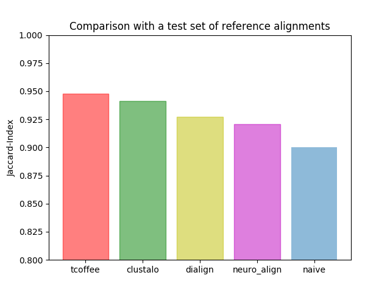

# NeuroAlign
A machine learning approach for Multiple Sequence Alignment (MSA)

# Design goals
- High prediction accuracy
- Fast
- Scaleable to potentially thousands of sequences

# How we try to achieve these goals
- NeuroAlign is trained on a concatenation of several well known and high quality MSA benchmark datasets based on additional 3D structural information
- NeuroAlign replaces potentially costly handcrafted searching algorithms with a fast prediction based on Graph Neural Networks (GNN)
- We carefully designed NeuroAligns underlying model in order to avoid components that scale quadratic or worse in the number of sequences

# Results so far

# Underlying model
Internally, NeuroAlign makes use of Graph Neural Networks (GNN). GNNs were already successfully applied to other NP-complete problems and grant many convenient properties for MSA prediction.
