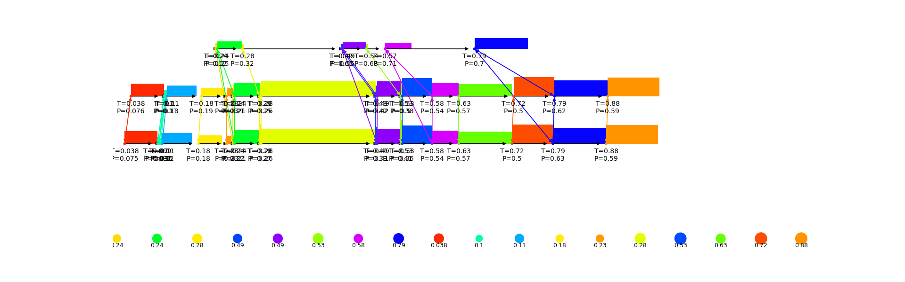

# NeuroAlign
A machine learning approach for Multiple Sequence Alignment (MSA)

# Design goals
- High prediction accuracy
- Fast
- Scaleable to potentially thousands of sequences

# How we try to achieve these goals
- NeuroAlign is trained on a concatenation of several well known and high quality MSA benchmark datasets based on additional 3D structural information
- NeuroAlign replaces potentially costly handcrafted searching algorithms with a fast prediction based on Graph Neural Networks (GNN)
- We carefully designed NeuroAligns underlying model in order to avoid components that scale quadratic or worse in the number of sequences

# Results so far

A prediction of NeuroAlign looks like this...
(T = "real" relative positions in the reference alignment
 P = relative positions predicted by NeuroAlign)

... and is computed by the following steps.

1) Search patterns (sets of high scoring, gapless regions in a subset of the sequences)
2) Build 2 graph networks (sequence and pattern) and do a number of alternating message passing steps, where...
3) ...the sequence graph is the graph of region nodes with foward edges
4) ...the pattern graph is the graph of region nodes connected with their respective pattern nodes (multiple instances of a pattern possible)
5) Model input are relative region positions in the raw sequences along with pattern scores 
6) Model output are relative region positions in the final alignment

